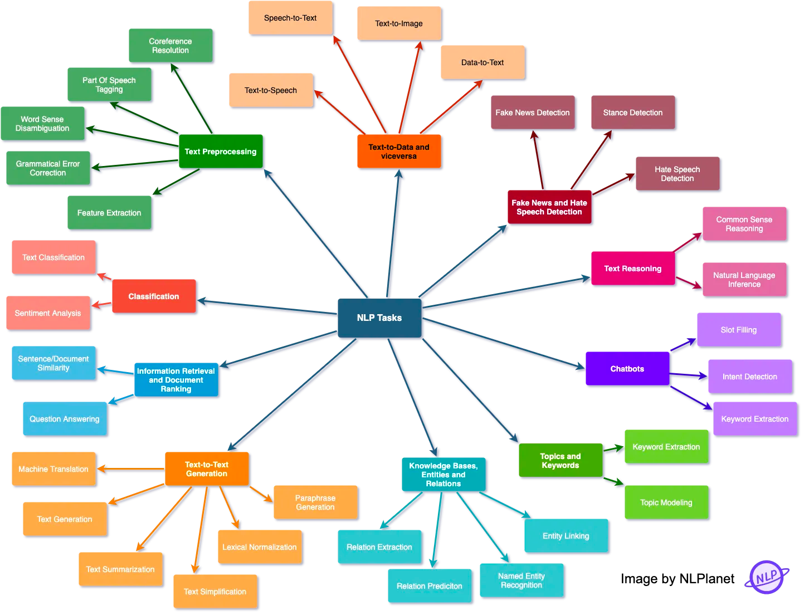

NLP common tasks:
- [Link](https://medium.com/nlplanet/two-minutes-nlp-33-important-nlp-tasks-explained-31e2caad2b1b)

- 

- `Classification`
    - `Text Classification`: assigning a category to a sentence or document (
      e.g. spam filtering).
    - `Sentiment Analysis`: identifying the polarity of a piece of text.

- `Information Retrieval and Document Ranking`
    - `Sentence/document similarity`: determining how similar two texts are.
    - `Question Answering`: the task of answering a question in natural
      language.

- `Text-to-Text Generation`
    - `Machine Translation`: translating from one language to another.
    - `Text Generation`: creating text that appears indistinguishable from
      human-written text.
    - `Text Summarization`: creating a shortened version of several documents
      that preserves most of their meaning.
    - `Text Simplification`: making a text easier to read and understand, while
      preserving its main ideas and approximate meaning.
    - `Lexical Normalization`: translating/transforming a non-standard text to a
      standard register.
    - `Paraphrase Generation`: creating an output sentence that preserves the
      meaning of
      input but includes variations in word choice and grammar.

- `Knowledge bases, entities and relations`
    - `Relation extraction`: extracting semantic relationships from a text.
      Extracted relationships usually occur between two or more entities and
      fall into
      specific semantic categories (e.g. lives in, sister of, etc).
    - `Relation prediction`: identifying a named relation between two named
      semantic entities.
    - `Named Entity Recognition`: tagging entities in text with their
      corresponding type, typically in BIO notation.
    - `Entity Linking`: recognizing and disambiguating named entities to a
      knowledge base (typically Wikidata).

- `Topics and Keywords`
    - `Topic Modeling`: identifying abstract “topics” underlying a collection of
      documents.
    - `Keyword Extraction`: identifying the most relevant terms to describe the
      subject of a document

- `Chatbots`
    - `Intent Detection`: capturing the semantics behind messages from users and
      assigning them to the correct label.
    - `Slot Filling`: aims to extract the values of certain types of
      attributes (
      or
      slots, such as cities or dates) for a given entity from texts.
    - `Dialog Management`: managing of state and flow of conversations.

- `Text Reasoning`
    - `Common Sense Reasoning`: use of “common sense” or world knowledge to make
      inferences.
    - `Natural Language Inference`: determining whether a “hypothesis” is true (
      entailment), false (contradiction), or undetermined (neutral) given a
      “premise”.

- `Fake News and Hate Speech Detection`
    - `Fake News Detection`: detecting and filtering out texts containing false
      and
      misleading information.
    - `Stance Detection`: determining an individual’s reaction to a primary
      actor’s
      claim. It is a core part of a set of approaches to fake news assessment.
    - `Hate Speech Detection`: detecting if a piece of text contains hate
      speech.

- `Text-to-Data and viceversa`
    - `Text-to-Speech`: technology that reads digital text aloud.
    - `Speech-to-Text`: transcribing speech to text.
    - `Text-to-Image`: generating photo-realistic images which are semantically
      consistent with the text descriptions.
    - `Data-to-Text`: producing text from non-linguistic input, such as
      databases of records, spreadsheets, and expert system knowledge bases.

- `Text Preprocessing`
    - `Coreference Resolution`: clustering mentions in text that refer to the
      same underlying real-world entities.
    - `Part Of Speech (POS) tagging`: tagging a word in a text with its part of
      speech.
      A part of speech is a category of words with similar grammatical
      properties,
      such as noun, verb, adjective, adverb, pronoun, preposition, conjunction,
      etc.
    - `Word Sense Disambiguation`: associating words in context with their most
      suitable
      entry in a pre-defined sense inventory (typically WordNet).
    - `Grammatical Error Correction`: correcting different kinds of errors in
      text such as spelling, punctuation, grammatical, and word choice errors.
    - `Feature Extraction`: extraction of generic numerical features from text,
      usually
      embeddings.
