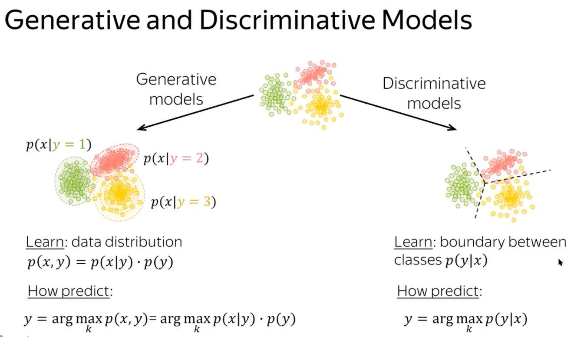
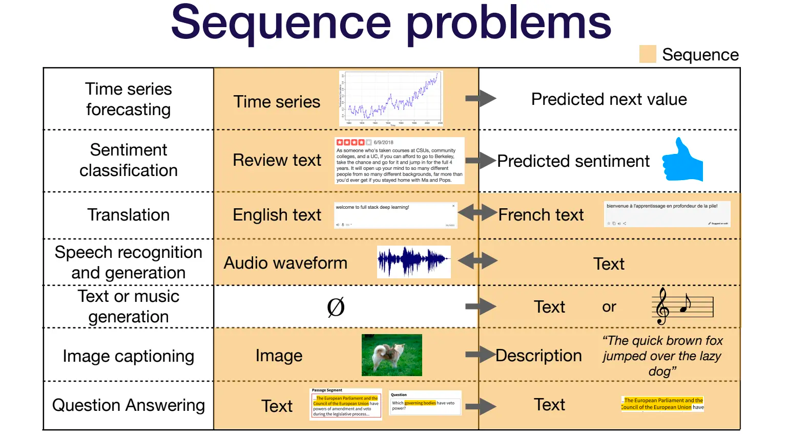
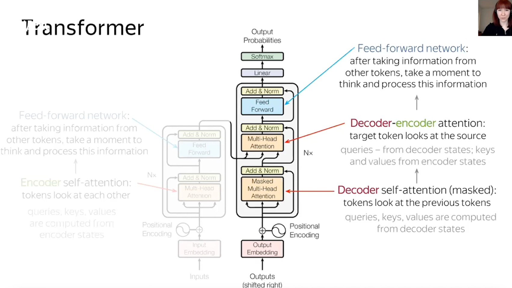

**Weeks overview**
- [Build own word embeddings from scratch](./src/week1/build-own-word-embeddings.ipynb)
- [Predict text sentiment using LSTM](./src/week2/sentence-sentiment-lstm.ipynb)

## Aha moments
At the moment, NLP is more of an empirical art than a science.

In practice always start from:
- start from the simplest model
- understand what did not work
- adjust data
- use more complex model

**High-level overview**
- tokenize sentences, represent token as a vector (embeddings)
    - numerous way to do so
    - the good one creates similar vectors for similar tokens
- feed vectors as input to DL model

**Ways to tokenize**
- word based
- n_gram based
- character based
- Subword
- sentencepiece
- more in week4

`DL` finds the features (statistical correlation) to satisfy back propagation
process.

For multi-class classification
- the more classes the more inaccurate model will be

Conceptual view of the NLP tasks:
- let's take a context of chatbot
- `classification` - identify what person want, their intent
    - find the function to call, e.g. `set_alarms`
- `name entity recognition` - identify parameters to the function
    - set_alarm(time=`5am`)

Why should I use old/non-DL models today?
- because I can explain model decision
- EU tries to regulate AI and create low that forces to explain decision in
  critical services, e.g. healthcare, employment, etc

- A lot of Linguists lost their jobs after `ELMo` was published.
- Mathematicians stayed alive) Looks like Math is ruling.

- BERT changed the NLP even more dramatically
- all different tasks that needed sophisticated models and researches before
  were replaced by just one BERT model

It's funny that ChatGTP produced such huge buzz, but not BERT

Vector vs Classic search:
- [Vector] For head queries (ie the most popular ones), knowing the exact
  results for the
  query just from clickstream data may be possible
- [Vector] For torso queries, a model needs to be trained to optimize relevance
  as there’s usually not direct clickstream data for this query to optimize relevance
- [Vector] For informational searches (question answering, etc) vector search may offer a good solution
- [Classic] For product searches, a set of factors, many (most?) independent of
  the query
  might mean a traditional LTR model would work best
- [Classic] For exact item lookups, like the name of a person or document, a
  straight-forward traditional search system might work best
- [Link](https://softwaredoug.com/blog/2023/02/13/why-vector-search.html)

GPT-3 takes about $5 million to do one training run.

BERT is not that old, and widely used now.

Why use older model:
- Depends on constrains that your system has
- device performance
- how fast response should be

List of tools:
- `spacy`
    - swiss knife for NLP tasks (tokenizer, part-of-speech, etc)
    - contains `en_core_web_md` - pre-trained model for english
    - [list of pre-trained models](https://spacy.io/models)
- `sklearn`
    - designed for traditional ML tasks
    - provides implementations of many popular machine learning algorithms
    - allow to train models for classification, regression, clustering, and
      dimensionality reduction
    - each to use api
    - has tools for data preprocessing and feature engineering, e.g.
    - methods for scaling, normalizing, and imputing missing data
    - has tool for validation
    - some alternatives
        - TensorFlow
        - Keras (high-level) api that works based on TensorFlow, and other
        - PyTorch - for DL models though
- `pytorch`
    - preferred across researches
    - similar to `sklearn` but for training various neural network-based models
    - more low-level and flexible than `sklearn`
    - supports distributed computing on GPUs
    - the lines between traditional ML and DL are becoming increasingly blurred,
    - it's not uncommon to see apps of both libraries in the same project
    - some alternatives
        - TensorFlow
- `TensorFlow`
    - preferred in the industry in general
- `Stanford NER`
    - [Link](https://nlp.stanford.edu/software/CRF-NER.html)

- who is `agent` in ML
    - usually it's a program, model
    - designed to solve a specific task or problem through learning and
      decision-making

**ML terms**
- `epoch`
    - hyperparameter
    - single pass through the entire training dataset
    - too few epoch and model underfits, too many can lead to overfitting

Model quality depends on:
- 

## Quick links
- [Github Projects](https://github.com/vm-mishchenko/2302-nlp-course)

## Learn more
- Yandex NLP is all you need, Awesome!!!
    - watch seminars or additional videos they mention for each week
    - [link](https://github.com/yandexdataschool/nlp_course)
- nice ML articles/videos from ML monster
    - [Link](https://eugeneyan.com/)
- ML course and resources
    - [Link](https://machinelearningmastery.com)
- Standford NLP course with recorded lectures
    - [Link](http://web.stanford.edu/class/cs224n/index.html)
- CoRise links: Attention, transformers:
    - 
- CoRise links: BERT
    - [NER](https://corise.com/course/natural-language-processing/v2/module/lstm#corise_cl2grke4o000s3g6drxa5i3ui)
    - [BERT](https://corise.com/course/natural-language-processing/v2/module/bert-and-retrieval)
- Most important NLP conferences
    - `NAACL`
        - [Link](https://www.youtube.com/results?search_query=NAACL+nlp+)
    - `ACL`
        - [Link](https://www.youtube.com/results?search_query=ACL+nlp+)
    - `EMNLP`
        - [Link](https://www.youtube.com/results?search_query=EMNLP+nlp+)
- Apply for work for Cohere.ai
    - [Link](https://cohere.ai)
- eBook about FAISS
    - [Link](https://www.pinecone.io/learn/faiss-tutorial/)
- Datasets
    - [Link](https://paperswithcode.com/datasets)
- Hugging Face course
    - [Link](https://huggingface.co/course/chapter0/1)
- "How to" for different tasks
    - [Link](https://huggingface.co/tasks)
- Two-tower architecture for search and recommendation
    - [Link](https://corise.com/course/natural-language-processing/v2/module/tokenization-retrieval#corise_cl2grnr7b001a3g6hvsxf9uf0)
- Read paper on 2-tower models
- [Search at Facebook](https://scontent-lga3-1.xx.fbcdn.net/v/t39.8562-6/246795273_2109661252514735_2459553109378891559_n.pdf?_nc_cat=105&ccb=1-7&_nc_sid=ad8a9d&_nc_ohc=ON_B4XQaMTQAX9F5LOd&_nc_ht=scontent-lga3-1.xx&oh=00_AfD04By1WLr_kxyupc8xqATZM_Vh2-xQSPd9etyOVXhH5A&oe=640C0EE3)
- [Youtube Recommendations](https://dl.acm.org/doi/pdf/10.1145/2959100.2959190)
- A friendly introduction to Deep Learning and Neural Networks
    - [Link](https://www.youtube.com/watch?v=BR9h47Jtqyw&list=WL&index=27)
    - really nice overview

## Week 1: Notes (Embeddings, Classification)

### Deep learning
**`ML` vs `DL`**
- ML user defines features
- DL learns features automatically
- DL does not need domain expert to defined features
- DL is more powerful when trained with huge amount of data
- you can explain the `ML` result, but not `DL` result
- ML is preferable for small data sizes
- the more data we provide the better `DL` will be, it's not the case with `ML`
- almost all the value today of `DL` is through learning from labeled data

**If you don't have enough data what should you use?**
- you can extract more with `DL`
- alternatively it's totally fine to go with simpler classifier

**Loss Function**
- Mean Squared Error (MSE)
- Binary Crossentropy (BCE)

**Activation Functions**
- use`ReLU` by default or some variants

### Word Embeddings
[Yandex lecture](https://github.com/yandexdataschool/nlp_course/tree/2022/week01_embeddings)

[Lena Voita website](https://lena-voita.github.io/nlp_course/word_embeddings.html)

**Why we need text representation:**
- to feed in ML
- we create Lookup table
    - token: embeddings
    - `UNK`: embeddings
- all unknown tokens replaced by `UNK`

**Ways to represent tokens**
- One-hot encoding
- Word embeddings

**One-hot encoding**
- e.g. token 'we' represented as [0,0 ..., 1, ...]
- each position in vector is token from vocabulary
- such encoding does not represent word meaning, semantics

**What is meaning**
- words which frequently appears in similar contexts have similar **meaning**
- context defined by all surrounding words
- as result, we need to **put information about context into word vectors**
- It's called `Distributional hypothesis`

**How to put context into embeddings?**
- **Count-based methods**
    - old methods to implement `Distributional hypothesis`
    - easy to analyze why we got particular vectors
- **Prediction-based Method** (e.g. Word2Vec model)
    - current methods to implement `Distributional hypothesis`
    - cannot understand why model build vectors in such way

**Count-based methods**
- used before 2014 year
- the main ideas is that we manually calculate statistics
    - people invent what feature we want to capture
    - and "manually" build embeddings
- there is no machine learning involved
- there are a lot of different methods that implements such ideas
    - Co-occurrence counts
    - Positive Pointwise Mutual Information (PMII)
    - Latent Semantic Analysis

General pipeline:

**Word2Vec (Prediction-based Method)**
- modern way, after 2014
- we **learn word vectors** by teaching them to **predict contexts**
    - e.g. we ask like - "Word, in which context you could appear"
    - no it's wrong! Gradient for you!

High-level pipeline:
- use window to slide across huge data set
- central words should predict surrounding words, e.g. context

**Some facts about Word2Vec**
- not a pre-trained model
- contains `DL` behind the scene that should be trained from my text
- trained model provides
    - words embeddings
    - similarity search (not sure whether it support sentences)
        - designed to support words
        - but can be used to support sentences (see "Doc2Vec")
    - analogy, e.g. fill the gap in "man is to woman as king is to ____"
    - word clustering
- I can download pre-trained Word2Vec models
    - [based on Google News](https://code.google.com/archive/p/word2vec/)

**Word2Vec Skip-Gram vs CBOW**
- there are two variants of Word2Vec
- Skip-Gram (most used) - from central predict context
- CBOW (Continues Bag of Words) - from sum of contexts predict central word

**Effect of Context Window size**
- `larger window` - more topic similarity
- `smaller window` - more functional and syntactic similarity
    - synonyms

**GloVe**
- combines count-based and prediction based
- alternative to `word2Vec`
- both very good
- from stanford

**fasttext**
- similar to `Word2Vec`
- can learn sub-words (not sure whether Word2Vec support it)
- pre-trained models
    - [Link](https://fasttext.cc/docs/en/pretrained-vectors.html)

**How to evaluate resulted embeddings?**
Globally there are 2 ways:
- **intrinsic** (based on internals)
    - how close two particular words to each other?
    - usually fast
    - does not tell what is better in practice
- **extrinsic** (based on the task we are trying to solve)
    - did embeddings solve classification task?
    - real task quite big, so it's time-consuming

In general, it's up to you.

**How tokenization influences ML?**
- helps to capture more meaning, e.g.
    - e.g. how we should tokenize "Aren't"? Ideally as ["Are", "n't"]
- not all languages contains spaces, maybe n_grams based tokens work better

**How vocabulary size influences model prediction?**
- big vocabulary size forces the model to have an enormous embedding matrix as
  the input and output layer, which causes both an increase in memory and time
  complexity
- A large vocabulary also means that we need to predict the next word across
  millions of options, which is a much harder problem
- if we restrict the model to only train on the top 50k words, we will suffer
  from a large number of unknown(UNK) or out of vocabulary(OOV) tokens. This
  negatively impacts our model quality, as grouping these rarer words into an
  UNK or OOV token removes information that the model could learn from
- If the vocabulary size is too small, the model may not be able to capture the
  nuances and complexity of the language, leading to inaccurate predictions. On
  the other hand, if the vocabulary size is too large, it can result in the
  model
  being unable to learn effectively, as there may not be enough data to
  adequately
  train the model on all of the rare words in the vocabulary.

**Character based tokenizers?**
- reduces our memory footprint
- dramatically reduce our model quality
- it is much harder for the model to learn meaningful representations of each
  character
- learning a meaningful context-independent representation for the letter "a" is
  much harder than learning a context-independent representation for the word "awesome"

### Classification
[Yandex lecture](https://github.com/yandexdataschool/nlp_course/tree/2022/week02_classification)

[Lena Voita website](https://lena-voita.github.io/nlp_course/text_classification.html)

**Task examples**
- `multi class`
    - there are finite set of mutually exclusive classes
    - word can belong to only one class from
- `multi label`
    - multiple labels could be assigned to one word
    - e.g. predict all hashtags for tweet

We need different methods when we have small and big data sets.

There are two approaches for classification:
- with **classical** models
- with **neural network** models

**Classical pipeline : define/extract features -> classify**
- `extract features` from text
    - **classical method** - manually define features
    - **neural method** - features are learned
- `classify` using different model types:
    - **discriminative** (most of the models for classification)
        - learns the relationship between the features the target class
        - logistic regression
        - support vector machines (SVMs)
        - neural networks such as `feedforward` neural networks and
          `convolutional` neural networks (CNNs)
    - generative
        - Naive Bayes
        - I did not understand

**Classical method for classification**
- "old" way of classifying
- all feature design manually

Why should I use old/non-DL models today?
- because I can explain model decision
- EU tries to regulate AI and create low that forces to explain decision in
  critical services, e.g. healthcare, employment, etc

`Naive Bayes`
- it's generative model
- very simple, fast and interpretable
- classical model where people all calculate manually
- no DL that learns features
- a lot of math/probability that I did not understand. Need to know Bayes.
- I guess we calculate probability of each token in sentence and sum it.
- using bag of words as word representation
- in general the model is really bad
- may win in terms of `quality-interpretability` trade off

`Logistic regression`
- discriminative model
- very simple and interpretable
- feature defined by hands
- using cross-entropy loss
    - the most standard loss for NN as well

`Support Vector Machines (SVM)`
- feature defined by hands

**Neural network pipeline : NN defines/extracts features -> classify**
- NN **learns** what features are important
- in classical approach human defines what features to extract

**The general flow**
- nn extract features to vector `d`
- pass vector `d` through linear layer that outputs vector with K-classes we
  want to predict. Let's call it vector `v`
- pass vector `v` though `softmax` function to output prediction to classes

**Linear layer**
- contains a set of Linear regression functions
- each Linear regression corresponds to class we are trying to predict
- in simple terms, Linear layer reduce incoming vector dimension to number of
  K-classes we are predicting

**Softmax**
- for each class returns probability
- sum of all probability will be always 1

**Types of NN we could use**
- Weighted (BOW)
- Convolutional
- Recurrent

**Weighted BOW NN**
- the simplest method
- it's not even NN
- sum of embeddings (bag of embeddings)
- better thn Bag of words, but not impressive
- we could add weights, but not necessary (it's NN after all)

**Convolutional NN**
- initially was for images
- can apply idea to text as well
- used a lot for classification
    - simple
    - quickly study feature
- idea: we need to transform words embeddings to one vector
- we use sliding window that take N words and represent them as one vector
    - this operation is called `Convolution`
- we use `pooling` layer to combine all convoluted vectors to one final vector
- which we then send for classification (same as for classical models)

Convolution parameters:
- kernel size
- stride

Typical convolution model:

More sophisticated convolution models:
- several convolutions with diff parameters
    - 
- stack convolution layers
    - 

**Recurrent NN**
Check week3.

**Practical tips**
There are several ways to create word Embeddings:
- `train from scratch`
    - bad when training data is small
- `take pretrained (transfer learning)` (word2vec)
    - are not specific for task
- `initialize with pretrained and then tune (transfer learning)`
    - the best approach

`Transfer learning` - one of the hottest thing that happens in NLP in 2021.

**Data augmentation**
- the idea is to change training data set to improve learning, e.g.
- `word dropout`
    - replace random words to `UNK` or any random words
    - replace random words to synonyms
- `tranlate back and forth`
    - get the same sentence passing it through some translator

### Project
- we are building text classification app
- this is a multi-class classification problem
- we will build different models and compare their performance
- models will be trained with different word embeddings
- we will test different embeddings and their effect on classification accuracy
    - `Avg(E(I)+E(like)+E(coding))` - avg word embedding
    - `Avg(E(I+like)+E(like+coding))` - sliding window
    - `build your own word embedding model` processing each character in words
- we will use Facebook chat conversation data
- each conversation has a label (classes) (joyful, etc.)
    - it will be 32 classes for this particular dataset
- we won't touch model type in this project

- we will use `pytorch`
- `pytorch` is ML framework
- defines the flow, e.g. training, validation, etc
- I have to implement just "implementation" details

- some python classes overview
- `Dataset` is class that keeps `sentence` and `label`
    - it's like the iterable list
    - allow to take one sample in a time
- `LightiningDataModule`
    - uses `Dataset` class
    - allows to select N samples in a time
    - batch size will be 30 samples
- granularity for this project is a sentence
    - word: 1x300 dimensions
    - sentence will be also 1x300 dimensions because we average all words in
      sentence
    - batch of sentences: 32x300
        - batch needed to parallel work, most probably
        - but maybe for training, let's see

- mentioned that `numpy` is traditional ML

- part 2, model 3
    - we will crate embeddings based on characters
    - it should include prediction accuracy
    - because we could learn unknown sentences
    - it helps with spelling errors, as we match partially correct sequence
    - characters embedding very useful for different languages as well

## Week 2: Notes (NER, RNN, LSTM)
**Goal to learn about:**
- name entity recognition (`NER`)
- Recurrent Neural Networks (`RNNs`)
- Long Short-Term Memory Networks (`LSTMs`)

### Name entity recognition (NER)
**Where NER is used:**
- `query expansion`
    - Obama height -> Barack Obama height
- `indentify parameters for the function`
    - set_alarms(time=`5AM`) see more in Aha moments
- `parsing unstructured data`
    - take resume, find experience, education, etc...
    - parse handwritten medical prescription, helping pharmacy tech stuff
    - make photo of contact card, find person's name and create digital record
- `parse jira ticket` and assign a proper team

**How we represent NER problem:**
- modeled as a sequence `labeling` problem
- ML should assign `label` for each token (word)

**Label consist of:**
- `type` - e.g. PERSON, TIME, etc
- `value` - e.g. John, 5AM

**2 ways to encode labels:**
- `IOB` (Beginning, Inside, Outside)
    - commonly used
    - each token/word is assign a particular `label`
    - e.g. "I am going to New York tomorrow"
        - "New" has label "B-LOC" (Beginning of Location token)
        - "York" has label "I-LOC" (Inside of Location token)
- `BILOU` (Beginning, Inside and Last tokens of multi-token chunks, Unit-length
  chunks and Outside)
    - more accurate

**How to define good labels**
- to have enough examples for each labels
- if you don't, reduce number of labels
    - combine multiple labels under one more general label
- use a hierarchical approach
    - "PERSON" label can be broken down into "AUTHOR", "ATHLETE", or "CELEBRITY"
- balance specificity and generality
    - should be specific enough to capture the information you need
    - but not so specific that they become unwieldy
- avoid overlapping labels
- consider negation, such as "not a person" or "not a location"

**Pre-trained vs custom models:**
- For general entities like, name, location
    - we could use pre-trained libs
        - `Stanford NER`
        - `spaCy`
        - `NLTK NE_Chunk`
        - [more](https://towardsdatascience.com/named-entity-recognition-3fad3f53c91e)
- For domain specific entities
    - needs to spend a lot of time on labeling
    - build the model

**Why NER is hard problem**
"John Smith" can refer to a person, a business, or a geographic location,
depending on the context.

### Recurrent Neural Networks
- RNN is family of neutral networks
- designed to process sequential data
    - natural language
    - data series
- `RNN` is trying to solve `feedfoward` network limitations
    - `feedfoward` doesn't pay attention in which order inputs were provided
    - `input1 -> input2` is the same as `input2 -> input1`
    - for text a sequence makes the difference!
    - `RNN` is trying to take into account sequence during training
    - in `RNN` the current input mixed with the previous hidden layer output
    - `feedfoward` expects constant input size, so it doesn't work with text
- RNNs can be combined with Long `Short-Term Memory` (LSTM) network

**RNN is often used in:**
- speech recognition
- language modeling
- machine translation
- forecasting of time series
- text creation
- text summarization and report generation
- image captioning

**Types of sequence problem**
- `one to one`
    - takes image outputs class
- `one to many`
    - takes an image and outputs a sentence of words
- `many to one`
    - take sentence output class
- `many to many`
    - translate text
    - input size can be different from output
- `synched many to many`
    - video classification where we wish to label each frame of the video

**How RNN works**
- RNN uses **encoder** and **decoder** architecture
- Both encoder and decoder are RNN networks

[Drawing link](https://excalidraw.com/#json=3waIXjJ_R0m4z2DulFhqY,fBDNYpZnzPb4X5lt6uTPeA)

High-level version:

Detailed version:

Encoder:
- compresses an entire input sequence into a single fixed vector
- vector is called `context` or `hidden state`

Decoder:
- the goal produce output sequence
- takes `context` as input
- generate output
    - one character
    - new context
- next Decoder step takes:
    - previously generated character
    - and the last context
- rinse and repeat

**How RNN knows when to stop generate output**
- it does not know
- it will continue generating output until it is explicitly instructed to stop
- some ways to stop generation:
- model such input size should b equal output size (`synched many to many`)
- RNN is trained to generate a special token, such as an end-of-sequence token
- introduce maximum length limit
- introduce specific condition that the output must satisfy

**Problems with RNN**
Conceptual problems:
- hard to encode all input information into one fixed size vector (context)
- hard to parallelize
    - you have to finish computation of previous word before start processing
      current word
- the context is biased towards the end of the encoder sequence
    - might miss important information at the start of the sequence

Technical problems:
- `Vanishing Gradient Problem`
    - don't understand it quite well but,
    - backpropagation process goes backward by the steps
    - on each step it improves the weights
    - for the first steps the slope will so small it won't be clear how to
      update the weights
    - this leads to long training time
- `Exploding Gradient Problem`
    - don't understand it quite well but
    - error accumulates rapidly across all sequence
    - producing huge parameter updates
    - to fix - clip the gradient at each step to a certain maximum value

### Long Short-Term Memory Network (LSTMs)
`LSTM` is the most popular way to solve RNN problems.

`LSTM` is the same as RNN but with smart memory.

The main difference is that `LSTM` cell also has its own state.

`LSTM` cell state has a lot more training variables.

`LSTM` has gates that control whether some particular info should be saved into
context or dropped.
- `forget`
    - decides what information should be thrown away or kept
    - closer to 0 means to forget, and the closer to 1 means to keep
    - not sure how it works though
- `input` gate
    - not sure how it works

**Problems with LSTM**
- gates requires bigger vector
- requires more time ot learn (because it should train more parameters)
- requires more data to train (not sure why)

**Solution for fixed size context vector**
Create stacked `LSTM`.

### GRU network
Newer generation of `RNN` networks.

Almost the same as `LSTM`.

`GRU` get rid of cell's state and uses hidden state (context) to trasnfer info.

Advice from teacher:
- `LSTM` should work perfectly
- use `GRU` only if for some reason `LSTM` did not work
- practically speaking, of `LSTM` did not work well, then I should use `BERT` or
  some transformer based models

### RNN vs LSTM
From industry experience:
- `RNN` works well for token length ~10
- `LSTM` works well for token length ~20
- both works well on device voice recognition problem
- `LSTM` has been around for ~6-7 years

Other:
- `RNN` used widely before `BERT` networks
- `BERT` is current state of the art in NLP
- `RNN` is still user
- mostly for latency sensitive app
- `RNN` is not super accurate
- but gets job done in most cases

**Read more**
- [translation example](https://towardsdatascience.com/language-translation-with-rnns-d84d43b40571)

### Classification Metrics
[Multiclass Classification Metrics](https://towardsdatascience.com/comprehensive-guide-on-multiclass-classification-metrics-af94cfb83fbd)

Make sure you are optimizing over the right metrics:
- `accuracy` bad metric for imbalanced classes, e.g. 70% of one specific class
- `precision` is better one for imbalanced classes
- `recall` is better one for imbalanced classes
- `f1-score` generalizes precision / recall

**Accuracy**
- works well for balanced classes, when we have equal examples for each classes
- takes all true positive and divide on number of all examples in dataset
- if one class dominates ,and we classified it well, then accuracy will be great
- but, we might mis-classified all other classes

[More about precision and recall](./../../../blog/230224-accuracy-precision-recall.md)

### Project
**Batch vs epoch**
- one epoch - is when we loop through all training data
- one epoch contains multiple batches
- size of the batch show be as big as possible
    - which depends on CPU, GPU, RAM I have
- another trick is to use distributed training
    - that's how BERT is trained

**Why we need padding**
- we want ot make sure that size of all vectors are the same
- GPU loves identical vector sized and works perfect with them

**Ideal training / test dataset proportion**
- training 80%
- test 20%

**What is Dropout parameter in RNN network?**
- it drops specified % of weight to 0 for one forward pass
- it helps to keep model from overfitting

**RNN(LSTM) vs Transformers**
- RNN works really well for small amount of data
- Transformers for huge datasets
- not sure what the logic behind it

## Week 3: Notes (Attention, Transformers, BERT, GPT)
**Goal**
- `attention`, `transformers`, `retrieval`, and `BERT`
- build a system to find duplicate questions on Quora

Yandex lecture about `attention` and `transformers`:
- superior material!!!
- [Link](https://github.com/yandexdataschool/nlp_course/tree/2022/week04_seq2seq)

### Attention
It's a mechanism that allows `decoder` to pay attention to specific `encoder`'s
hidden states (i.e. tokens) while generating output token.

- solves `RNN` problems:
    - encoder tries to pack all representation in one fix-sized vector
    - this vector stores more info about last tokens and forget about first one
    - decoder tries to predict all output sequence based on this output vector
    - model should be trained sequentially, not parallel computing

How `LSTM` model works with attention:
- `encoder` generates hidden state for each token
- `encoder` generates final hidden state that represent all sequence state
- `decoder` to generate next token takes as input:
    - previous hidden state
    - previously generated token
    - `attention`
- `decoder` predict output

`Attention` is a vector that represent embeddings from encoder that are
important to generate current token.

Attention is a vector and calculated for each decoder's step by following:

1. take incoming decoder hidden state
2. calculate weights for each encoder hidden states
    - The weight reflects how important this particular encoder's state for the
      current the output decoder is trying to predict
    - In other words, how important tokens "я", "видел", " котю", "на", "мате"
      to predict next token for the sequence "I saw a ..."
    - there different way to calculate the weights, e.g.
        - dot-product (simple but working)
        - bilinear
        - multi-layer perceptron
    - we could train seperate network to learn weights to generate weights
3. calculate new context state vector
    - is a vector that combines all encoder states based on calculated weights
    - captures information what tokens in initial sequence are the most
      important for the current decoder prediction

### Transformers
It's a neural network model that uses only `attention`, no RNN/LSTM.

TLDR: each token cares about its own hidden state calculated from other's
tokens state. There is no hidden state for the whole sequence as LSTM has.

Google has an incredible illustration how it works:

**Encoder / Decoder**
Encoder:
- each token in encoder contains and updates its own hidden_state
- this state calculated based on the state of all other tokens state
- there are multiple layers in encoder
- each layer repeats the same calculation, just accumulates more features
- huge benefits that layer could be calculated in parallel

Decoder:
- each token cares about its own hidden state
- this state calculated based on the state of all other decoders/encoders states
- check gif above, it much better conveys what is going on

After first layer us calculated, model "see" all the words. It means it can
produce output words in parallel as well.

**Self-attention**
When token looks on each other and gather its own context:

**Masked Self-attention**
Same self attention, but decoder does not see future encoder's tokens.

The idea is that decoder has to predict them and not just copy from encoder.

**Multi-head attention**
Each token has the vector size for hidden state.

But different part of this vector stores different information.

**Transformer Model architecture summary**
Encoder part:
- tokens look at each other (self-attention, multi-head attention block)
- tokens generate its own state (feed forward block)

Decoder part:
- tokens look at each other (decoder self-attention, multi-head attention block)
- tokens look at encoder tokens (decoder-encoder self-attention, multi-head
  attention block)
- tokens generate its own state (feed forward block)

### Transfer learning
Concept appeared in ~2018 and changed everything.

It's the most modern way of doing NLP.

Main idea:
- Train model for word embeddings (`Auxiliary model`)
- Use embeddings in your current classification model
- Your current model (`Task Specific`) uses the knowledge from other model
- You've just `Transfered knowledge` from one model to another

It's just one simple example.

There are different types of `Transfer learning`:
- `transductive`
    - domain adaptation
    - class-lingual learning
- `inductive`
    - multi-task
    - **sequential transfer learning** <--most popular today

Different `Auxiliary model` types:
- Word Embeddings
- ELMo
- BERT

**Word Embeddings Auxiliary model**
- Word2Vec
- GloVe

### ELMo
**ELMo Auxiliary model**
- the main idea: word embeddings encodes other words nearby (context)
    - i.e. from word to word in context
- best paper in fall 2018
- HUGE shift in NLP
- before NLP researches specialized in diff areas, e.g. classification, Q&A
- everyone tried to tune their models to get a bit better results
- in average such people spend 1 year for one article
- ELMo beat all of them
- ELMo general approach was better than all their local optimization
- a lot of people lost funding
- before people has linguistic background
- it was shock for them that their language knowledge did not help
- but the BERT beat ELMo afterwards

Technical details:
- word embeddings with token based convolution
- few LSTM networks in parallel
- and then combine everything together

How to use ELMo:
- Use ELMo to generate word embeddings
- but wi still need Task specific model
    - p.s. BERT does not need it for the most common tasks

### BERT
**BERT Auxiliary model**
- instead of LSTM in ELMo, use transformers
- transformer-encoder architecture
- what was special:
    - [learn more](https://youtu.be/_BFp4kjSB-I)
    - new training objectives:
        - `Masked language modeling` (main task)
        - `Next Sentence prediction` (pre-training task)
    - loooots of data
- bi-directional model
- uses a subword tokenizer called `WordPiece`
- google made
- laid off even more people than `ELMo`
- best paper in fall 2019
- before that, even with ELMo you still need `Task specific model`
- with `BERT` you need just `BERT`
- people start modifying `BERT`
- facebook fixed some bugs and released `RoBERTa`
- after `BERT` question people asked shifted dramatically, e.g.
    - how we can apply BERT for other task
    - how to make BERT smaller / faster
- `BERT` is everywhere today
    - Google search
    - Yandex Taxi

**Masked language modeling:**
- randomly pick 15% tokens
- replace them to either
    - [mask],
    - random token
    - leave original token
- train model to predict initial (replaced) words
- model should understand context to predict replaced word

**Next Sentence prediction:**
- give two sentences as input
- in one case they are random in other consecutive
- model should predict the variant
- in theory model should understand smth about sentences to predict outcome

**How to use BERT**
- as encoder
    - as encoder BERT can vectorize input perfectly
    - I can train a Task model (decoder) to get the end result
- us ultimate model
    - no need for `Task model`
    - `BERT` is ultimate model

**Some examples below:**
- Text classification
- Whether sentence linguistically acceptable

**Sentence Pair classification**
- does second sentence contradict first one?
- are two sentences semantically identical?
- given two sentences return similarity score

**Question answering: find answer in text**
- uses Next Sentence prediction feature
- first sentence is question
- train model to label answer in second text

### GPT
**GPT(1-2-3)**
- transformer decoder architecture (no encoder)
- trained to predict next word
- then model can be fine-tuned for specific task by creating new layer
- during fine-tuning the basic layer could be also tuned, but not necessary
    - [learn more](https://youtu.be/LOCzBgSV4tQ)
- 96 layers of decoders for GPT-3
- GPT-3 takes about $5 million to do one training run
- left to right education
- enormous model
- people are questioning how to properly evaluate such model?
- maybe we think the model is powerful because we treat it easy

**Why GPT is better than BERT for text generation**
- it's bigger model
- it's trained on more data
- it's trained to generate text

**Adaptors**
How can tune model for our task:
- fine tuning
    - retrain the whole model
    - each model will take a lot of space
- create adapter
    - train small NN on top of BERT or GTP
    - adapters are small
    - could be easily replaced
    - currently there are HUGE number of adapters

### Analysis and Interpretability
**Analysis and Interpretability**
There are few ways:
- `Probing for linguistic structure`

`Probing for linguistic structure`:
- we use model to train classificator to predict part of speech
- we benchmark model by how well classificator was trained
- assumption is if the model gives coherent embeddings then classificator better
  predicts part of speech

BERT rediscovered NLP pipeline:
- before BERT linguist thought that to solve high-level abstract task you first
  need to solve more simple one
- list of tasks from core to more complex:
    - Part of speech
    - Constituents
    - Dependencies
    - Entities
    - Semantic Role labeling
    - Coreference

- it turns out that BERT is learning feature in the same sequence
- looks like linguists were right

### Project

`FAISS` is an index for efficiently storing searchable embeddings of objects (
e.g. sentences, images, ...)

## Week 4: Notes (Tokenization, Two-tower networks)
Learn about:
- tokenization (subword segmentation)
- two-tower networks
- siamese networks
- GPT
- build smart compose system

### Tokenization
**Different token types**
- `Word based` tokenizers
- `Character based` tokenizers
- `Subword` tokenization
    - Do not split the frequently used words into smaller subwords
    - Split the rare words into smaller meaningful subwords.
- `SentencePiece`
    - all algo above assume that the text uses spaces to separate words
    - treats the input as a raw input stream
    - [Doc](https://github.com/google/sentencepiece)
- [more](https://corise.com/course/natural-language-processing/v2/module/tokenization-retrieval)

**When to use different tokenizer**
- when I'm building my own custom model
- with BERT or GPT I have to use the same tokenizer as they are using

**Why do I need custom tokenizer**
- when my prompt is not human language
    - e.g. SQL, or MongoDB query ... etc
- BERT and GPT expect input in human language

### Two-tower networks
- modern architecture for personalized search and recommendation
- one network convert user's profile, query, location, etc. to embedding
- another network convert's content to embedding
- then it matches the closest request and content embeddings
- potentially could deploy 2 towers separately
- [Link](https://corise.com/course/natural-language-processing/v2/module/tokenization-retrieval#corise_cl2grnr7a000p3g6hiaatorwz)
- [read more](https://corise.com/course/natural-language-processing/v2/module/tokenization-retrieval#corise_cl2grnr7b001a3g6hvsxf9uf0)